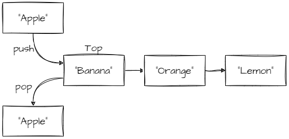
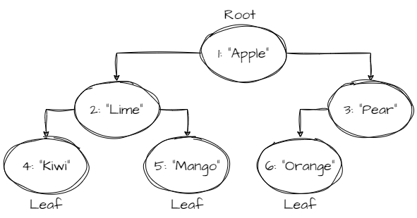

<p align="center">
  
</p>

# Structurify

A collection of fundamental data structures implemented in TypeScript, widely used in computer science and software development. This library includes implementations of various structures that can be effortlessly imported and employed in your projects.

Included Data Structures:

- [Singly Linked List](#singly-linked-list),
- [Doubly Linked List](#doubly-linked-list),
- [Queue](#queue),
- [Stack](#stack),
- [Binary Tree](#binary-tree),
- [Binary Search Tree](#binary-search-tree)

## Installation and Usage

### 1. Install the Package
Install the `structurify` package using npm in your project directory:
```
npm i structurify --save
```
### 2. Import Data Structures
Using ESM (ECMAScript Modules)

If you are using ECMAScript Modules in your project:
```ts
import {
  SinglyLinkedList, DoublyLinkedList, Queue, Stack, BinaryTree, BinarySearchTree,
} from 'structurify';
```
Using CommonJS

If you are using CommonJS in your project:
```ts
const {
  SinglyLinkedList, DoublyLinkedList, Queue, Stack, BinaryTree, BinarySearchTree,
} = require('structurify');
```
### 3. Utilize Data Structures
Now, you can create instances of the data structures and use their methods according to your application's requirements. Here's a brief example:
```ts
// Example with a Singly Linked List
const singlyList = new SinglyLinkedList();
singlyList.add(1);
singlyList.add(2);
singlyList.add(3);

console.log(singlyList.toArray()); // Output: [1, 2, 3]
```
Feel free to explore and utilize the various methods provided by each data structure in the structurify library based on your specific use cases. The library aims to simplify the implementation of common data structures in your JavaScript/TypeScript projects.

## Singly Linked List
A linear data structure consisting of nodes where each node points to the next one in the sequence. It provides efficient insertion and deletion operations, especially when elements need to be frequently added or removed from the beginning of the list.


### How to use
```ts
// Example usage
import { SinglyLinkedList } from 'structurify';

const myList = new SinglyLinkedList<number>();
myList.push(5).push(10).push(15);

console.log(myList.toArray()); // Output: [5, 10, 15]

myList.pop();
console.log(myList.toArray()); // Output: [5, 10]
```

### API Reference
For detailed information, please refer to the [Singly Linked List API Reference](src/docs/class-api/singly-linked-list.md).

### Time and Space complexity
| Method             | Time Complexity | Space Complexity |
|--------------------|-----------------|------------------|
| `static fromArray` | O(n)            | O(n)             |
| `at`               | O(n)            | O(1)             |
| `deleteAt`         | O(n)            | O(1)             |
| `insertAt`         | O(n)            | O(1)             |
| `nodeAt`           | O(n)            | O(1)             |
| `pop`              | O(n)            | O(1)             |
| `push`             | O(1)            | O(1)             |
| `reverse`          | O(n)            | O(1)             |
| `rotateByN`        | O(n)            | O(1)             |
| `shift`            | O(1)            | O(1)             |
| `setAt`            | O(n)            | O(1)             |
| `toArray`          | O(n)            | O(n)             |
| `unshift`          | O(1)            | O(1)             |

#### Inherited from BaseLinkedTree
| Method      | Time Complexity | Space Complexity |
|-------------|-----------------|------------------|
| `clear`     | O(1)            | O(1)             |

- **n** - the number of nodes in the singly linked list.

## Doubly Linked List
Similar to a singly linked list, a doubly linked list also consists of nodes, but each node has two pointers: one pointing to the next node and another pointing to the previous node. This allows for more flexibility in traversal and efficient insertion or deletion operations at both ends of the list.


### How to use
```ts
import { DoublyLinkedList } from 'structurify';

const dll = new DoubleLinkedList<number>();
dll.push(5).push(10).push(15);

console.log(dll.toArray()); // Output: [5, 10, 15]

dll.reverse();
console.log(dll.toArray()); // Output: [15, 10, 5]

dll.deleteAt(1);
console.log(dll.toArray()); // Output: [15, 5]
```

### API Reference
For detailed information, please refer to the [Doubly Linked List API Reference](src/docs/class-api/doubly-linked-list.md).

### Time and Space complexity
| Method             | Time Complexity | Space Complexity |
|--------------------|-----------------|------------------|
| `static fromArray` | O(n)            | O(n)             |
| `at`               | O(n)            | O(1)             |
| `deleteAt`         | O(n)            | O(1)             |
| `insertAt`         | O(n)            | O(1)             |
| `nodeAt`           | O(n)            | O(1)             |
| `pop`              | O(1)            | O(1)             |
| `push`             | O(1)            | O(1)             |
| `reverse`          | O(n)            | O(1)             |
| `shift`            | O(1)            | O(1)             |
| `setAt`            | O(n)            | O(1)             |
| `toArray`          | O(n)            | O(n)             |
| `unshift`          | O(1)            | O(1)             |

#### Inherited from BaseLinkedTree
| Method      | Time Complexity | Space Complexity |
|-------------|-----------------|------------------|
| `clear`     | O(1)            | O(1)             |

- **n** - the number of nodes in the doubly linked list.

## Queue
A queue is a **first-in, first-out (FIFO)** data structure that follows the principle of order preservation. Elements are added to the back (enqueue) and removed from the front (dequeue). It is useful for scenarios where the order of processing is critical, such as in breadth-first search algorithms.


### How to use
```ts
import { Queue } from 'structurify';

const queue = new Queue<number>();

queue.enqueue(5);
queue.enqueue(10);
queue.enqueue(15);

console.log(queue.dequeue()); // Output: 5
console.log(queue.peek()); // Output: 10
console.log(queue.toArray()); // Output: [10, 15]

queue.clear();
console.log(queue.isEmpty); // Output: true
```

### API Reference
For detailed information, please refer to the [Queue API Reference](src/docs/class-api/queue.md).

### Time and Space complexity
| Method     | Time Complexity | Space Complexity |
|------------|-----------------|------------------|
| `clear`    | O(1)            | O(1)             |
| `dequeue`  | O(1)            | O(1)             |
| `enqueue`  | O(1)            | O(1)             |
| `peek`     | O(1)            | O(1)             |
| `peekRear` | O(1)            | O(1)             |
| `toArray`  | O(n)            | O(n)             |

- **n** - the number of nodes in the queue.

## Stack
A stack is a **last-in, first-out (LIFO)** data structure where elements are added (push) or removed (pop) from the top. It is suitable for scenarios where the order of processing involves a last-in, first-out pattern, such as function call management or expression evaluation.
  


### How to use
```ts
import { Stack } from 'structurify';

const stack = new Stack<number>();

stack.push(5);
stack.push(10);
stack.push(15);

console.log(stack.pop()); // Output: 15
console.log(stack.peek()); // Output: 10
console.log(stack.toArray()); // Output: [10, 5]

stack.clear();
console.log(stack.isEmpty); // Output: true
```

### API Reference
For detailed information, please refer to the [Stack API Reference](src/docs/class-api/stack.md).

### Time and Space complexity
| Method    | Time Complexity | Space Complexity |
|-----------|-----------------|------------------|
| `clear`   | O(1)            | O(1)             |
| `peek`    | O(1)            | O(1)             |
| `pop`     | O(1)            | O(1)             |
| `push`    | O(1)            | O(1)             |
| `toArray` | O(n)            | O(n)             |

- **n** - the number of nodes in the stack.

## Binary Tree
A binary tree is a hierarchical data structure where each node has at most two children, referred to as the left child and the right child. It provides efficient searching, insertion, and deletion operations. Traversal methods, such as in-order, pre-order, and post-order, allow for exploring and processing the tree's elements in various orders.



### How to use
```ts
import { BinaryTree, TraversalOrder } from 'structurify';

const tree = new BinaryTree<number, string>(); 

tree.add(1, 'Apple');
tree.add(2, 'Lime');
tree.add(3, 'Pear');
tree.add(4, 'Kiwi');
tree.add(5, 'Mango');
tree.add(6, 'Orange');

console.log(tree.size) // 6

for (let fruit of tree.values(TraversalOrder.LevelOrder)) {
  console.log(fruit) // 'Apple', 'Lime' 'Pear', 'Kiwi', 'Mango', 'Orange'
}
```

### API Reference
For detailed information, please refer to the [Binary Tree API Reference](src/docs/class-api/binary-tree.md).

### Time and Space complexity
| Method                        | Time Complexity | Space Complexity |
|-------------------------------|-----------------|------------------|
| `static fromEntries(entries)` | O(n)            | O(w)             |
| `add(key, val)`               | O(n)            | O(w)             |
| `addMany(entries)`            | O(n log n)      | O(log n)         |
| `delete(key)`                 | O(n)            | O(w)             |
| `get(key, order)`             | O(n)            | O(h) or O(w)     |
| `has(key, order)`             | O(n)            | O(h) or O(w)     |
| `set(key, val, order)`        | O(n)            | O(h) or O(w)     |
| `node(key)`                   | O(n)            | O(h) or O(w)     |

#### Inherited from `BaseBinaryTree`
| Method                 | Time Complexity | Space Complexity |
|------------------------|-----------------|------------------|
| `clear()`              | O(1)            | O(1)             |
| `entries(order)`       | O(n)            | O(h) or O(w)     |
| `every(fn, order)`     | O(n)            | O(h) or O(w)     |
| `findNode(fn, order)`  | O(n)            | O(h) or O(w)     |
| `findValue(fn, order)` | O(n)            | O(h) or O(w)     |
| `forEach(fn, order)`   | O(n)            | O(h) or O(w)     |
| `isEqual(root)`        | O(n)            | O(h)             |
| `isBalanced()`         | O(n)            | O(h)             |
| `isComplete()`         | O(n)            | O(w)             |
| `isFull()`             | O(n)            | O(h)             |
| `isPerfect()`          | O(n)            | O(h)             |
| `keys(order)`          | O(n)            | O(h) or O(w)     |
| `maxDepth()`           | O(n)            | O(h)             |
| `some(fn, order)`      | O(n)            | O(h) or O(w)     |
| `values(order)`        | O(n)            | O(h) or O(w)     |

- **n** - the number of nodes in the binary tree.
- **h** - the height of the binary tree.
- **w** - the maximum width of the binary tree.

## Binary Search Tree
A binary search tree is a binary tree with the additional property that the left subtree of a node contains only nodes with keys less than the node's key, and the right subtree contains only nodes with keys greater than the node's key. This ordering property facilitates efficient search operations, making it a useful data structure for storing and retrieving sorted data.


### How to use
```ts
import { BinarySearchTree, TraversalOrder } from 'structurify';

const tree = BinarySearchTree.fromSortedEntries<number, string>([
  [1, 'Kiwi'],
  [2, 'Lime'],
  [3, 'Mango'],
  [4, 'Apple'],
  [5, 'Orange'],
  [6, 'Pear'],
]);

console.log(tree.size) // 6

for (let fruit of tree.values(TraversalOrder.InOrder)) {
  console.log(fruit) // 'Kiwi', 'Lime' 'Mango', 'Apple', 'Orange', 'Pear'
}
```

### API Reference
For detailed information, please refer to the [Binary Search Tree API Reference](src/docs/class-api/binary-search-tree.md).

### Time and Space complexity
| Method                                          | Time Complexity | Space Complexity |
|-------------------------------------------------|-----------------|------------------|
| `static fromEntries(entries, comparator)`       | O(n log n)      | O(log n)         |
| `static fromSortedEntries(entries, comparator)` | O(n)            | O(log n)         |
| `add(key, val)`                                 | O(log n)        | O(log n)         |
| `addMany(entries)`                              | O(n log n)      | O(log n)         |
| `delete(key)`                                   | O(log n)        | O(log n)         |
| `get(key)`                                      | O(log n)        | O(1)             |
| `has(key)`                                      | O(log n)        | O(1)             |
| `set(key, val)`                                 | O(log n)        | O(1)             |
| `node(key)`                                     | O(log n)        | O(1)             |

#### Inherited from `BaseBinaryTree`
| Method                 | Time Complexity | Space Complexity |
|------------------------|-----------------|------------------|
| `clear()`              | O(1)            | O(1)             |
| `entries(order)`       | O(n)            | O(h) or O(w)     |
| `every(fn, order)`     | O(n)            | O(h) or O(w)     |
| `findNode(fn, order)`  | O(n)            | O(h) or O(w)     |
| `findValue(fn, order)` | O(n)            | O(h) or O(w)     |
| `forEach(fn, order)`   | O(n)            | O(h) or O(w)     |
| `isEqual(root)`        | O(n)            | O(h)             |
| `isBalanced()`         | O(n)            | O(h)             |
| `isComplete()`         | O(n)            | O(w)             |
| `isFull()`             | O(n)            | O(h)             |
| `isPerfect()`          | O(n)            | O(h)             |
| `keys(order)`          | O(n)            | O(h) or O(w)     |
| `maxDepth()`           | O(n)            | O(h)             |
| `some(fn, order)`      | O(n)            | O(h) or O(w)     |
| `values(order)`        | O(n)            | O(h) or O(w)     |

- **n** - the number of nodes in the binary tree.
- **h** - the height of the binary tree.
- **w** - the maximum width of the binary tree.